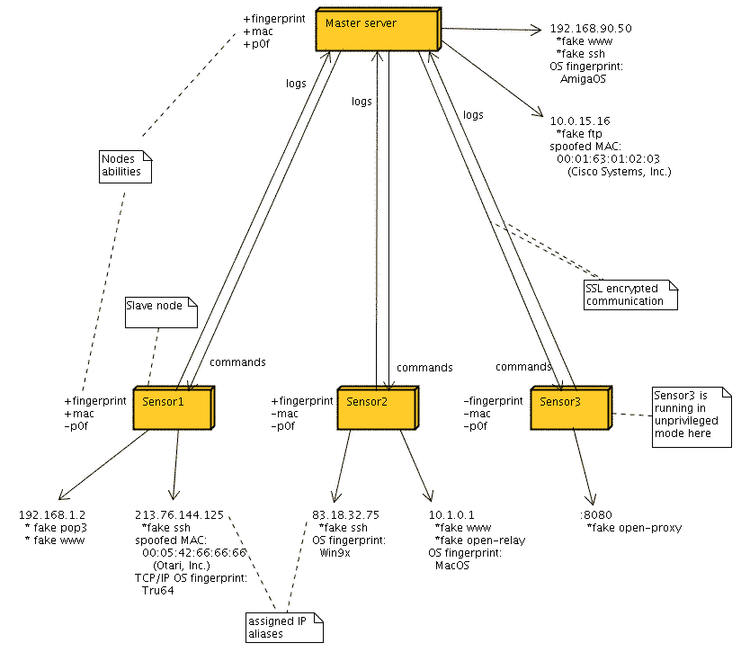

# HoneySpy - Advanced Honeypot Environment

## Authors
* Robert Nowotniak
* Michal Wysokinski

## Description

Honeypot is a tool helpful in early intrusion detection and prevention systems
and useful for analysis of uknownk security flaws, 0-day exploits, cracker's
tools and such.

HoneySpy project allows you to create, setup, maintain and monitor the network
of honeypot servers. It's written in general in Perl.
By using tools such as p0f, ebtables, ippersonality and others on network nodes
it allows you to simulate various operating systems' TCP/IP stacks, and
detecting it on the remote hosts at the same time.
Mangling MAC addresses of used IP aliases is possible as well (to prevent
detection of honeypots by the attackers, who compared MAC addresses in the
network).

Apart from that HoneySpy provides a super-server functionality (similar to
inetd for e.g.). Simple modules are available to simulate vulnerable or weird
services. 

## Requirements
* Perl 5.6 or newer
* Log::Log4perl
* IO::Socket::SSL
* NetPacket
* Net::Pcap

